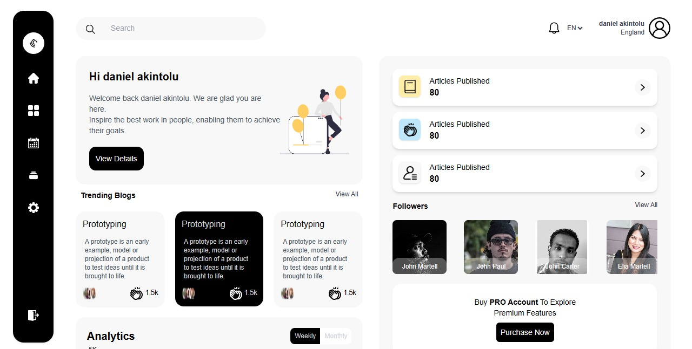

# Bloggy - Blog Site Dashboard

Welcome to the Bloggy GitHub repository! Bloggy is a comprehensive dashboard for a blog site, empowering users to manage their blog content efficiently. The dashboard was built with React, Chart.js, Tailwind CSS, Firebase for user authentication, Framer Motion, and the News API for fetching real-time news.

## Live Site

Access the live Bloggy dashboard [here](https://dashboard-brown-nu.vercel.app).

## Features

- User-friendly dashboard to manage blog posts, categories, and user settings.
- Interactive data visualizations using Chart.js, providing insights into blog analytics.
- Firebase integration for secure user authentication and management.
- Smooth animations with Framer Motion, elevating the dashboard's aesthetics.
- Real-time news integration from the News API, keeping users informed and inspired.

